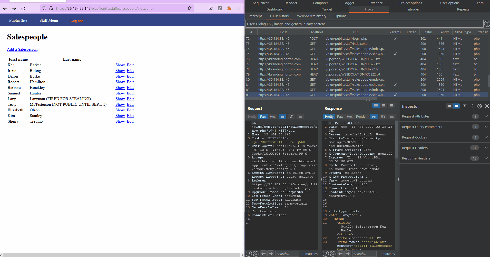
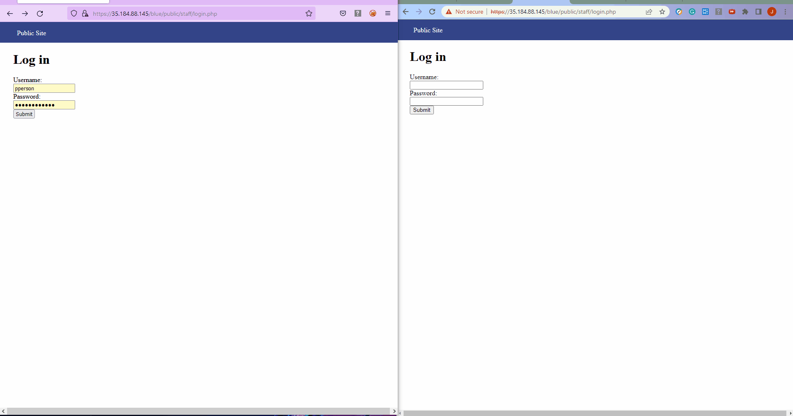
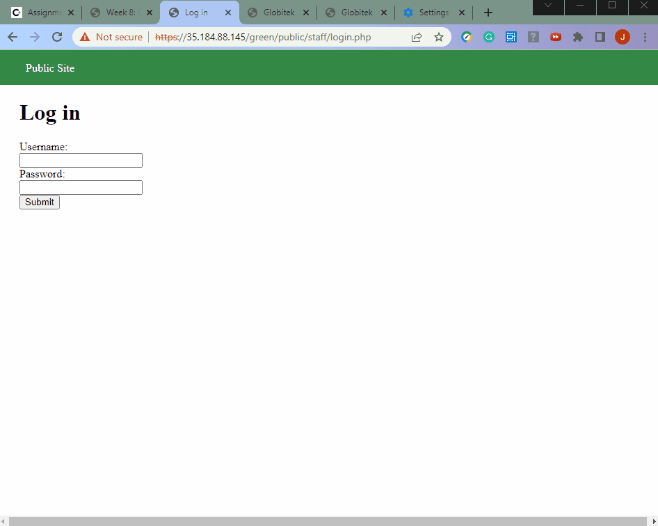
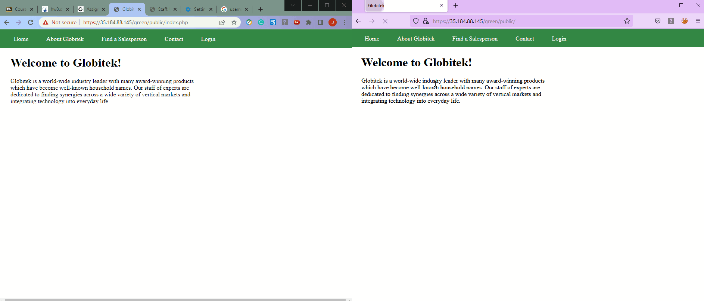
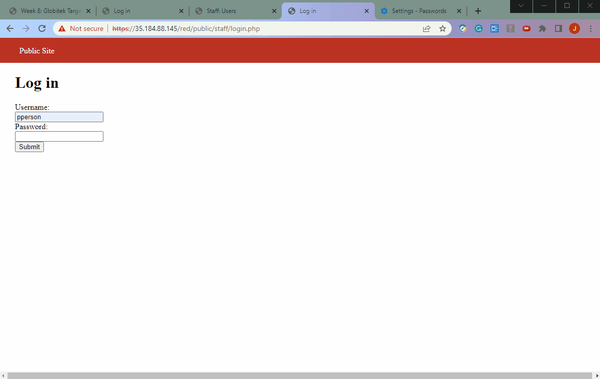

# Project 8 - Pentesting Live Targets

Time spent: **10** hours spent in total

> Objective: Identify vulnerabilities in three different versions of the Globitek website: blue, green, and red.

The six possible exploits are:

* Username Enumeration
* Insecure Direct Object Reference (IDOR)
* SQL Injection (SQLi)
* Cross-Site Scripting (XSS)
* Cross-Site Request Forgery (CSRF)
* Session Hijacking/Fixation

Each color is vulnerable to only 2 of the 6 possible exploits. First discover which color has the specific vulnerability, then write a short description of how to exploit it, and finally demonstrate it using screenshots compiled into a GIF.

## Blue

Vulnerability #1: SQL Injection

Description: The sales person directory uses the id parameter in the url to perfoem SQL searches witout sanitization. This can be seen as we can place a variety SQL conditional clauses in the id parameter and reach different pages and results.




Vulnerability #2: Session Hijacking/Fixation

Description: By changing the PHPSESSIONID value of a not-logged-in user to a PHPSESSIONID of a logged-in-user, the not-logged-in user can bypass the login and view all the information a logged-in-user can see.



## Green

Vulnerability #1: Username Enumeration

Description: Valid usernames can be seen by the text type of  "Log in was unsuccessful". If the username in the log in exists then the text type will be bold and if the username does not exist then the text will be not bolded.



Vulnerability #2: Cross-Site Scripting

Description: The XSS code can be stored into a webpage through submitting the code as part of the Contact Us form to provide feedback. The feedbak is stored and then loaded up by the admin intiating the XSS attack. 
Example XSS code: ```<script>alert('Hacker48 found the XSS!');</script>```
The gif on the left shows the submision of the form and the gif on the right shows the admin viewing it.




## Red

Vulnerability #1: Insecure Direct Object Reference

Description: By changing the id parameter, we can acces a profile that isn't supposed to be public (id=10). The other two sites( Green and Blue) do not have this.



Vulnerability #2: Cross-Site Request Forgery

Description:
Was not Completed

## Notes

I was able to get a cross-site request forgery to work however I could not figure out how I could make it not seen and could not make the results of the submision form not seen.
